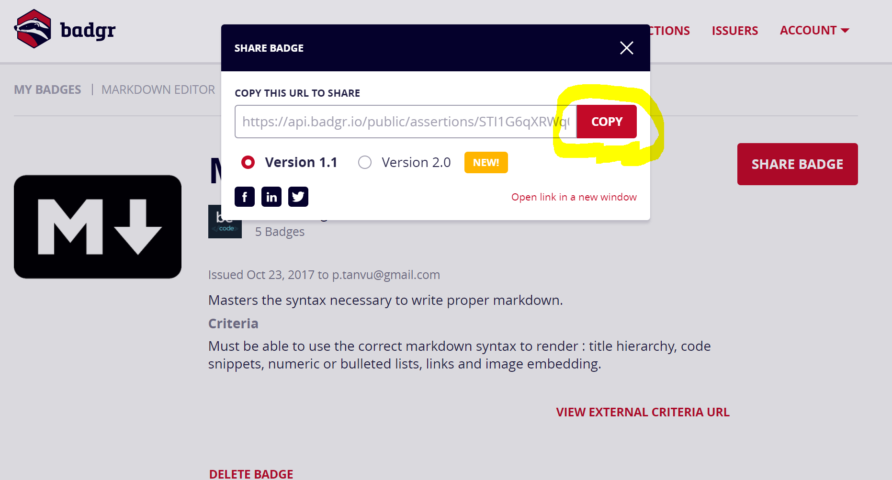
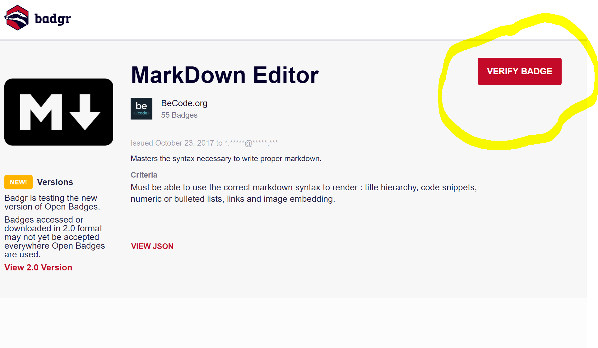

# Petit Tuto Badge LinkedIn

##

> S'inscrire avec l'adresse email avec laquelle vous avez reçu vos badges. 

  

  
  

> Dans l'onglet my badges vous allez avoir automatiquement tous les badges liés à votre adresse email. 

  
  
  

> Sélectionnez le badge que vous voulez afficher sur votre profile LinkedIn. Cliquez sur Share Badge.  

  
  
  

> Copiez le lien  

  
  
  

> Sur votre profile LinkedIn, allez sur réalisations et cliquez sur le + à coté de certifications.

  
  
  

> Remplir les différents champs. Ne pas remplir le champ numéro de licence et collez l'url précédemment copier. Enregistrer pour finir. 

  
  
  

> Vous avez maintenant la certification qui apparaît en bas de la page LinkedIn. Cliquez sur voir la certification pour vérifier.

  
  
  

> Vous devriez tomber sur cette page qui indique la date de remise du badge. Poursuivez en cliquant sur verify badge.

  
  
  

> Ici, il faut juste entrer son adresse email dans le champ Recipient ID  

  
  
  

> Et voilà  
